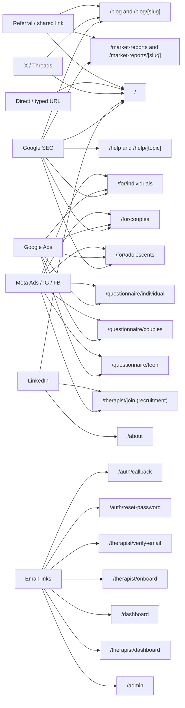
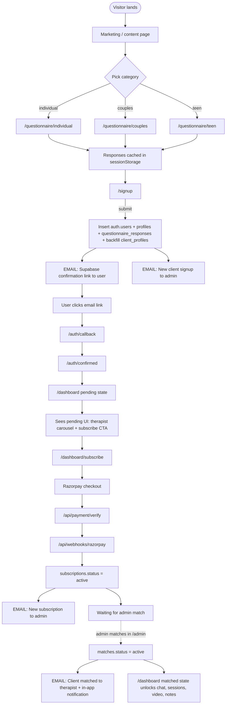
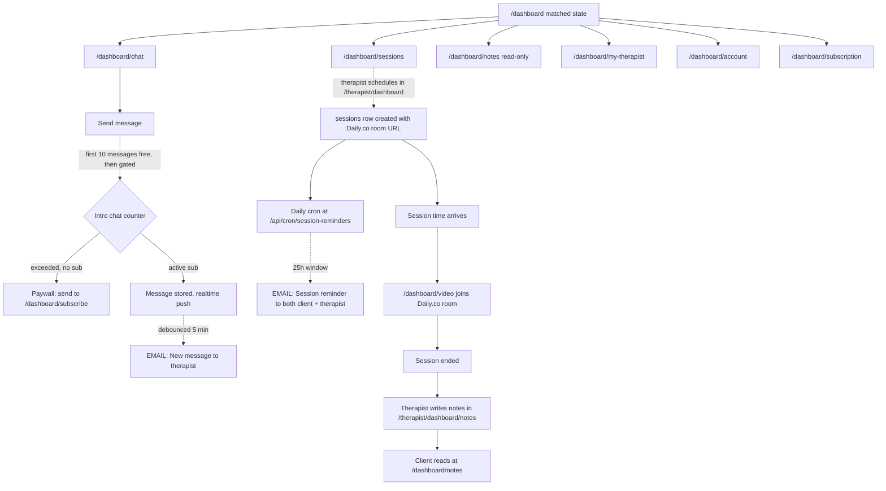
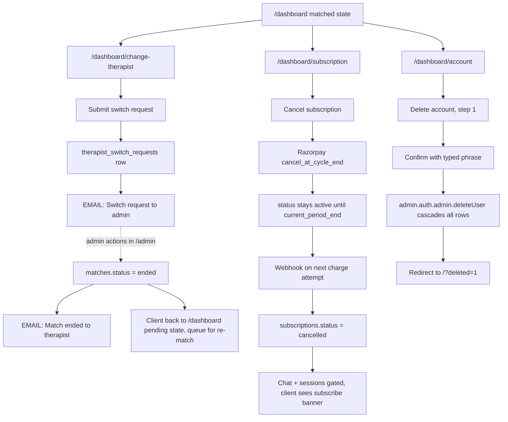
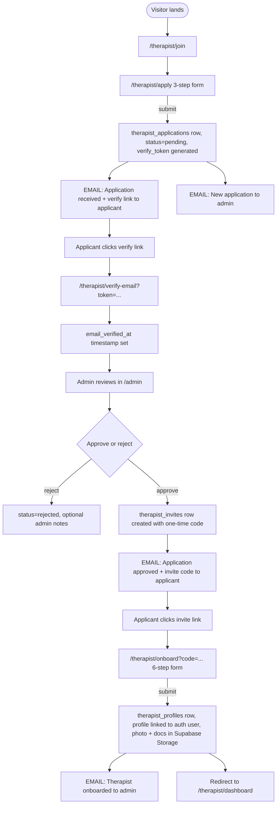
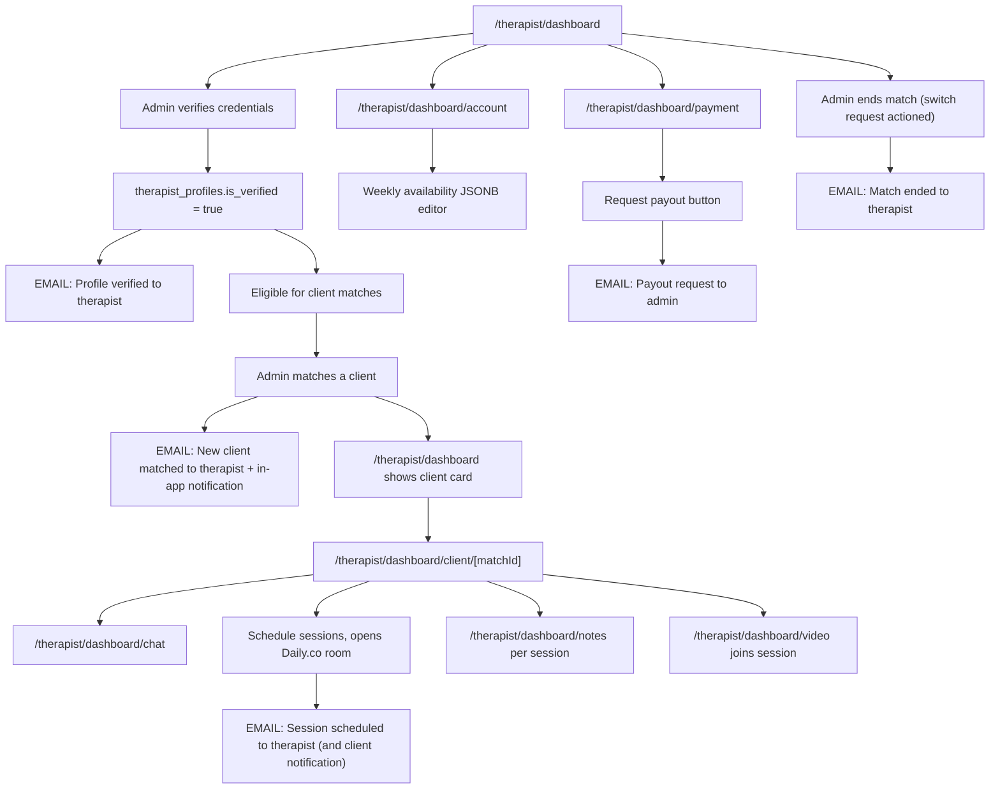
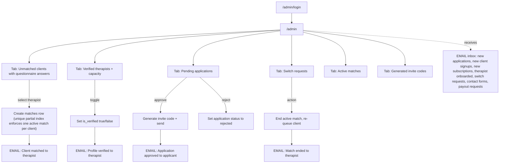

# MindCanopy User Journey & Sitemap

Reference for every user type, traffic source, page, action, and email touchpoint on MindCanopy. Each Mermaid block below is paste-ready into Notion.

## User types

| Type | DB role | Auth required |
|---|---|---|
| Visitor | none | no |
| Client | `client` | yes |
| Therapist | `therapist` | yes |
| Admin (Niharika) | `admin` | yes |

## Diagrams index

1. Acquisition sources to landing pages
2. Full sitemap by role
3a. Client journey: visitor to matched
3b. Client journey: ongoing engagement
3c. Client journey: switch, cancel, delete
4a. Therapist journey: applicant to onboarded
4b. Therapist journey: active practice
5. Admin operations
6. Email touchpoints (trigger to recipient)

---

## 1. Acquisition sources to landing pages

---

## 2. Full sitemap by role

```mermaid
flowchart TB
    Root["mindcanopy.in"]

    Root --> PUB["Public no auth"]
    Root --> CL["Client role=client"]
    Root --> TH["Therapist role=therapist"]
    Root --> AD["Admin role=admin"]

    PUB --> P_Home["/"]
    PUB --> P_Brand["/about, /contact"]
    PUB --> P_Legal["/privacy, /terms"]
    PUB --> P_Content["/blog, /market-reports, /help"]
    PUB --> P_For["/for/individuals, /for/couples, /for/adolescents"]
    PUB --> P_Quest["/questionnaire/individual, /questionnaire/couples, /questionnaire/teen"]
    PUB --> P_Auth["/signup, /login, /forgot-password"]
    PUB --> P_AuthCB["/auth/callback, /auth/confirmed, /auth/reset-password"]
    PUB --> P_TFun["/therapist/join, /therapist/apply, /therapist/verify-email, /therapist/onboard"]
    PUB --> P_Gates["/therapist/login, /admin/login"]

    CL --> C_Dash["/dashboard"]
    C_Dash --> C_Profile["/dashboard/account, /dashboard/subscription, /dashboard/subscribe"]
    C_Dash --> C_Therapy["/dashboard/my-therapist, /dashboard/change-therapist"]
    C_Dash --> C_Comm["/dashboard/chat, /dashboard/video, /dashboard/notes, /dashboard/sessions"]
    C_Dash --> C_Support["/dashboard/faq, /dashboard/reviews, /dashboard/contact"]

    TH --> T_Dash["/therapist/dashboard"]
    T_Dash --> T_Profile["/therapist/dashboard/account, /therapist/dashboard/payment"]
    T_Dash --> T_Clients["/therapist/dashboard/client/[matchId]"]
    T_Dash --> T_Comm["/therapist/dashboard/chat, /therapist/dashboard/video, /therapist/dashboard/notes"]
    T_Dash --> T_Support["/therapist/dashboard/faq, /therapist/dashboard/contact"]

    AD --> A_Dash["/admin"]
```

---

## 3a. Client journey: visitor to matched

---

## 3b. Client journey: ongoing engagement

---

## 3c. Client journey: switch, cancel, delete

---

## 4a. Therapist journey: applicant to onboarded

---

## 4b. Therapist journey: active practice

---

## 5. Admin operations

---

## 6. Email touchpoints

Every email currently sent by the system, grouped by recipient.

### To applicant / new user
| Trigger | Template | Sender route | Recipient |
|---|---|---|---|
| Signup form submit | Supabase confirmation link | `supabase.auth.signUp` | New user |
| Forgot password form | Supabase reset link | `supabase.auth.resetPasswordForEmail` | Existing user |
| Therapist apply submit | Application received + verify-email link | `sendApplicationReceivedEmail` | Applicant |
| Admin approves application | Application approved + invite code | `sendApplicationInviteEmail` | Applicant |

### To therapist (in-app + email)
| Trigger | Template | Type |
|---|---|---|
| Admin creates match | Client matched | `client_matched` |
| Admin ends match | Match ended | `client_unmatched` |
| Client sends message (debounced 5 min) | New message | `client_message` |
| Admin sets is_verified | Profile verified | `profile_verified` |
| Therapist schedules session | Session scheduled | `session_scheduled` |
| Daily cron, session within 25h | Session reminder | `session_reminder` |

### To client (in-app + email)
| Trigger | Template | Type |
|---|---|---|
| Daily cron, session within 25h | Session reminder | `session_reminder` |

Note: no welcome email, no match-confirmation email, no payment-confirmation email to clients today. Clients get the in-app notification when matched, but the only email they ever receive after signup is the session reminder cron. **See `TODO.md` Dev section, "Email templates".**

### To admin (admin@mindcanopy.in)
| Trigger | Template |
|---|---|
| Therapist submits application | New application |
| New client signs up | New client signup |
| Client completes Razorpay payment | New subscription |
| Therapist completes onboarding | Therapist onboarded |
| Client submits switch request | Switch request (`tplSwitchRequest`, via `sendNotificationEmail`) |
| Visitor submits `/contact` form | Contact form |
| Therapist clicks "Request payout" | Payout request |

### Currently NOT sent (gaps)
- Welcome email to new client after signup
- Match-made email to client (only therapist gets one)
- Payment confirmation / receipt to client (Razorpay sends its own; we don't)
- Switch request status update to client (after admin actions)
- Session-scheduled email to client (therapist gets one, client only sees in-app)
- Session-ended / notes-available email to client
- Subscription expiring / renewal reminder to client
- Onboarding nudge emails (questionnaire abandoned, signed up but not subscribed, etc.) — see TODO Dev section "Marketing nudge emails"
- Therapist application rejected email to applicant
- Payout completed email to therapist

---

## Key observations

1. **No global welcome email for clients.** The Supabase confirmation link is the only post-signup email. Worth adding a branded welcome.
2. **Client only ever gets one type of email** after signup: session reminders. All match, message, and subscription events are silent on email for clients.
3. **Lead-form pages (questionnaire, signup, therapist apply/onboard) don't carry the footer.** Intentional. Privacy and Terms are only surfaced on main marketing pages and as a passive disclaimer on `/signup`.
4. **Verify-email step doesn't notify admin or change visible state.** The application appears in admin's queue at submit time, not at verify time. The `email_verified_at` timestamp is recorded but not currently used to gate approval.
5. **`TEST_CODE = 'ZENSPACE2026'`** in `app/therapist/onboard/actions.ts:11` is a backdoor invite-code that bypasses validation. Anyone who types it gets through onboarding.
6. **No reminder or drip for stalled funnels.** A visitor who completes the questionnaire but doesn't sign up, or signs up but doesn't subscribe, receives nothing.
7. **Razorpay merchant approval expects Terms link in checkout.** Today Terms is only in the footer and the signup disclaimer line.
